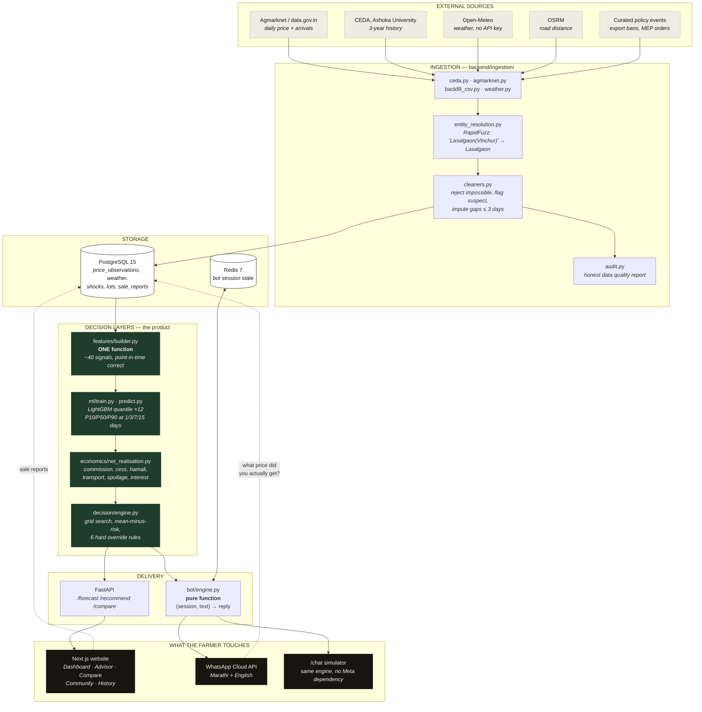
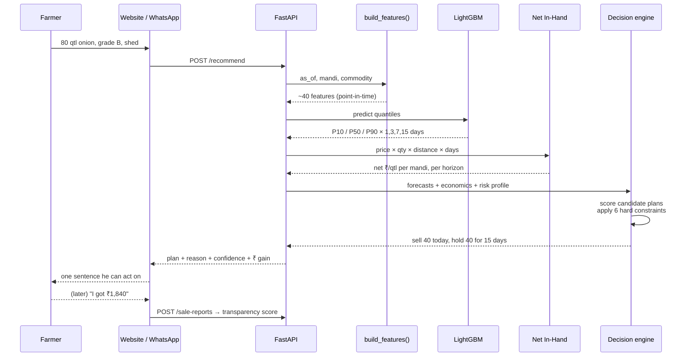

# Architecture

Bhav Setu turns raw mandi prices into one sentence a farmer can act on: how much to
sell today, where, and how much to hold. This page shows how the pieces fit.

The system is four layers with one rule between them — **every number a farmer sees
has been through the economics engine**. Nothing quotes a board price directly.

---

## 1. System architecture



---

## 2. Why it is shaped this way

**One feature function, not two.** `build_features()` is called by training, by
backtesting and by the live API. Most projects write a notebook version and a
serving version, they drift apart, and the live system quietly performs far worse
than the notebook claimed. A point-in-time assertion inside the function raises if
any row newer than the as-of date reaches the feature window.

**Economics sits between the model and the farmer.** A forecast of ₹2,010 at
Lasalgaon is not an answer. After 3% commission, 1.05% cess, hamali, the diesel for
62 km and whatever rots in a week, the farmer sees something closer to ₹1,842. The
striking consequence is that **the market with the highest price is often not the
best market**, and that flip is what the Compare page exists to show.

**The bot is a pure function.** `(session, text) → reply` has no knowledge of
WhatsApp. The webhook and the `/chat` web simulator both call it, so if Meta
approval or the tunnel fails on demo day, the story is unchanged.

**Sale reports flow backwards.** Anyone can scrape a price board. Only a system
farmers talk to learns what they were *actually paid* — and that gap, per mandi,
is the transparency score no competitor has.

---

## 3. Repository layout

```
bhav-setu/
├── config/          every tunable number — fees, mandis, crops, risk lambdas
│   ├── mandis.yaml         the 5 Nashik mandis
│   ├── crops.yaml          perishability, spoilage constant, max hold days
│   ├── cost_model.yaml     commission, cess, hamali, transport, interest
│   └── decision.yaml       risk lambdas, constraint thresholds
│
├── db/schema.sql    19 tables, single file, no migrations
│
├── backend/
│   ├── core/        config loader, DB engine, structured logging, typed errors
│   ├── ingestion/   fetch → resolve → clean → audit
│   ├── features/    registry.py (the ordered list) + builder.py (the function)
│   ├── ml/          baselines, training, prediction, SHAP explanations
│   ├── economics/   spoilage + net realisation
│   ├── decision/    engine, constraints, confidence
│   ├── bot/         engine, intents, session, mr/en locales
│   └── api/         FastAPI routers
│
├── frontend/
│   ├── app/         Dashboard · Advisor · Compare · Community · History · Chat
│   ├── components/  ForecastChart, NetComparisonTable, CostWaterfall, ChatWindow
│   └── lib/         api.ts is the single seam to the backend
│
└── scripts/         init_db · backfill · train · backtest · seed_demo_data
```

**Everything tunable lives in `config/`.** Fee percentages, which mandis are
covered, how many days ahead we forecast, how risk-averse the optimiser is — all
YAML, none of it buried in Python. Adding a crop is a config edit, not a code
change.

---

## 4. Request path for one recommendation



---

## 5. Current build status

| Layer | State |
|---|---|
| Config + schema + seeds | Working, tested |
| Ingestion pipeline | Written and running; data volume is the open problem |
| Feature builder | Written; needs denser history to validate |
| Model, economics, decision | Specified; mirrored in TypeScript for the web demo |
| Website | Complete — 16 routes, 51 logic tests, 36 route tests |
| WhatsApp | Deep link live; webhook pending Meta approval |

The website currently runs on a seeded data layer that mirrors the Python
contracts exactly. `frontend/lib/api.ts` is the single seam — each function
becomes a `fetch` when the API lands, and no component changes.
