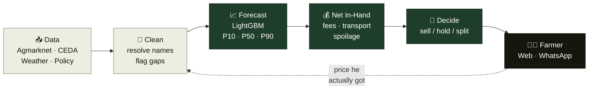
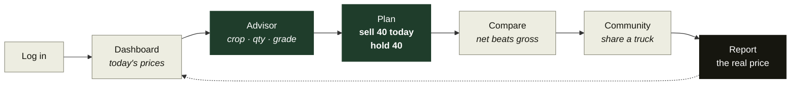
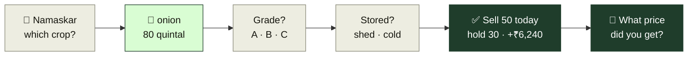
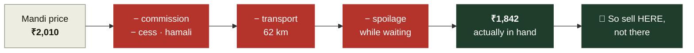

# Slide diagrams

Cut-down versions of the diagrams in [architecture.md](architecture.md) and
[user-flow.md](user-flow.md), sized for a 16:9 slide. All left-to-right, under
eight boxes each, no nested subgraphs — they stay readable when shrunk.

To get an image: open this file in VS Code (Ctrl+Shift+V) or on GitHub, then
screenshot the rendered diagram.

---

## 1. Architecture

**One line for the slide:** raw prices in, one actionable sentence out — and what
he was really paid flows back in.

---

## 2. User flow

**One line for the slide:** five taps from opening the app to knowing what to do.

---

## 3. WhatsApp bot

**One line for the slide:** works in Marathi, on a ₹4,000 phone, with buttons —
nothing to type but a number.

---

## Optional: the one-slide version

If you only have room for a single diagram, use this — it carries the whole
argument in six boxes.

**One line for the slide:** every other product shows the ₹2,010. We show the
₹1,842 — and that changes which mandi he drives to.
