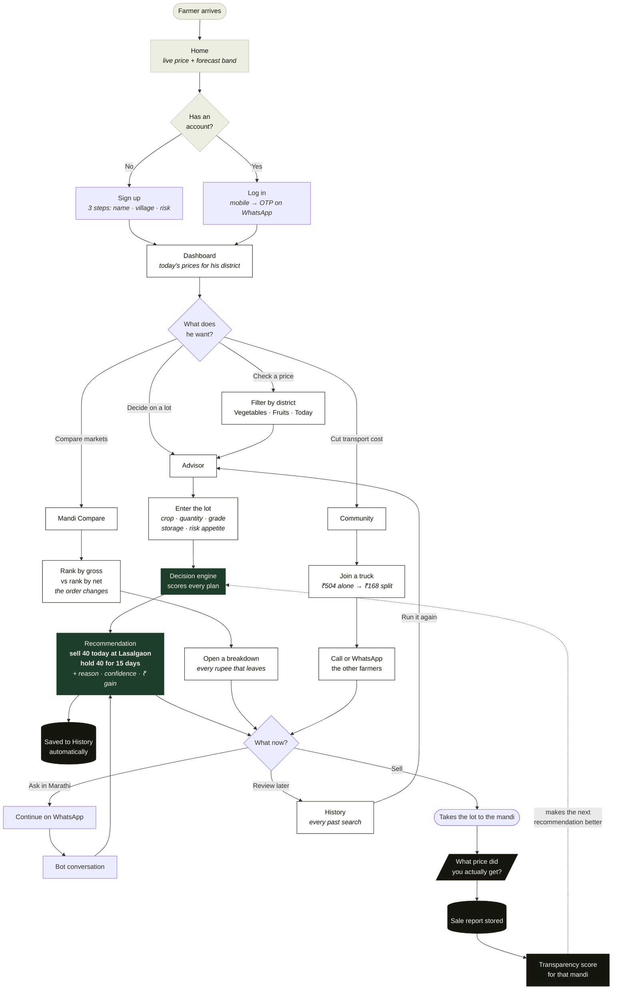
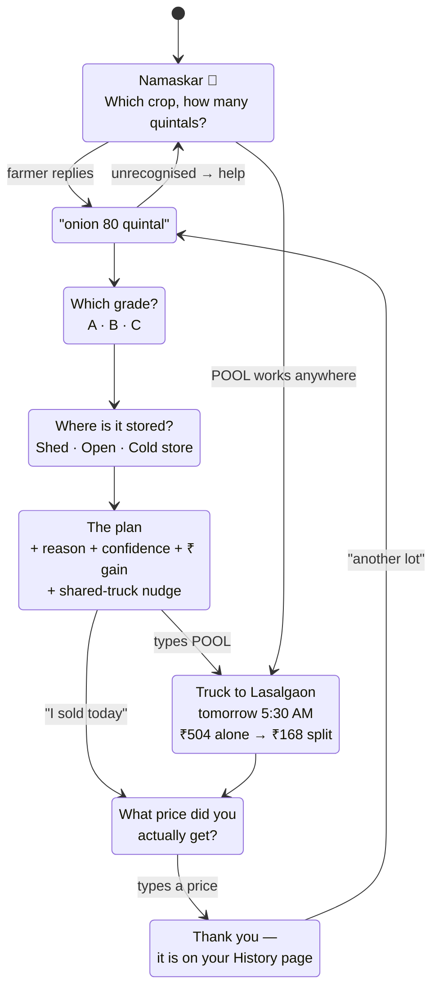

# User flow

Two ways in — the website and WhatsApp — and they meet at the same decision engine.
This page traces what a farmer actually does, screen by screen.

---

## 1. The main journey

The dotted line at the bottom is the part that matters commercially: **what the
farmer was really paid feeds back into the next recommendation.**

---

## 2. WhatsApp conversation

The bot is a state machine. Every step offers quick-reply buttons, so a farmer on
a ₹4,000 phone never has to type more than a number.

`POOL` is recognised at any point in the conversation, and anything the bot cannot
parse returns a help message with buttons rather than a dead end.

---

## 3. What each screen is for

| Screen | The farmer's question | What he leaves with |
|---|---|---|
| **Home** | Is this worth my time? | A live price and an honest forecast band |
| **Dashboard** | What is my district paying today? | Every crop, best mandi per crop, arrivals |
| **Advisor** | What do I do with *this* lot? | Sell/hold split, in rupees, with a reason |
| **Compare** | Which mandi should I drive to? | Net ranking — often not the highest price |
| **Community** | Can I cut my transport cost? | A truck to share, and numbers to call |
| **History** | What did they tell me last time? | Every past search, re-runnable |
| **Chat** | Can I just ask in Marathi? | The same plan, in a conversation |

---

## 4. The three decisions that shape every screen

**A range, never a single number.** Every forecast is P10–P50–P90. Nobody can
predict onion to the rupee, and pretending otherwise is how a farmer with a loan
gets ruined. When the band is too wide, the system says so and pushes toward
selling today.

**Net in hand, never the board price.** Commission, cess, hamali, weighing,
packing, road distance, storage, interest and spoilage all come out before any
number is shown. `net_per_qtl` is divided by the *original* quantity, so anything
that rots during a hold shows up as a lower rate rather than hiding in a total.

**Hard rules override the maths.** Six constraints sit above the optimiser: never
hold past a crop's shelf life, never hold through a spoilage cliff, never send a
tiny lot ninety kilometres, and if the government just banned exports, sell today
and do not argue.

---

## 5. Recording walkthrough

The path that shows the most in the least time:

1. **Log in** — mobile number, then the code
2. **Dashboard** — switch district, switch to Fruits, click a row to change the chart
3. **Advisor** — start on onion (a split with a rupee gain), switch to tomato and
   watch it flip to sell-now because tomato spoils
4. **Compare** — change the crop, open a Breakdown, point at the rank flip
5. **Community** — the ₹504 → ₹168 saving, and the call buttons
6. **History** — the searches from steps 3 and 4 are already listed
7. **Chat** — run the flow, then type `POOL`
8. **EN → मराठी** — the toggle works throughout
